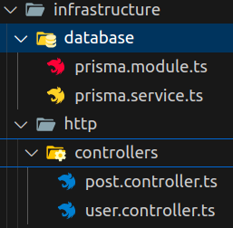

# Studends Help (SH)

## Description

Student Help est une application web à destination des étudiants (les restrictions de géolocalisation arriveront dans un second temps).

Il est possible aux étudiants de s'inscrire et de se connecter à l'application afin d'écrire des annonces.
Ces annonces sont des invitations à une entraide généralisée.

## Fonctionnalités

- Inscription et connexion des utilisateurs
- Gestion des publications (création, lecture, mise à jour, suppression)
- Documentation Swagger pour une utilisation facilitée de l'API

## Technos utilisées

- Environnement back sous docker
- Back:
  - API: NestJs
  - ORM: Prisma
  - BDD: Postgres
- Front:
  - UI: React
  - Composants: Chakra UI
  - Store: Redux Toolkit

## Schéma de la base de données


## Diagramme C4

### Diagramme de Contexte


### Diagramme de Container


### Diagramme de Composant


### Diagramme de Code


## Choix de l'architecture logicielle


### Exemple 1


### Exemple 2



## Design Patterns

Les designs patterns suivants ont principalement été utilisés afin de respecter les bonnes pratiques dictées par la documentation du framework NestJs.

Il serait potentiellement dangereux de beaucoup dévier des bonnes pratiques et d'être victime d'un projet très rapidement non maintenable.

Afin de faire une analyse sur les choix techniques, il est bon de rappeler l'utilité de ce graphique, la matrice de risques, qui permet de pondérer les risques encourus lors d'une décision.


### Decorator Pattern

<u>Définition RefactoringGuru :</u>  
Décorateur est un patron de conception structurel qui permet d’affecter dynamiquement de nouveaux comportements à des objets en les plaçant dans des emballeurs qui implémentent ces comportements.


<u>Explications :</u>  
Dans ce cas précis, nous venons surcharger la méthode getAll() afin de créer une route GET qui nous renvoira la donnée retournée par la méthode.

### Singleton Pattern

<u>Définition RefactoringGuru :</u>  
Singleton est un patron de conception de création qui garantit que l’instance d’une classe n’existe qu’en un seul exemplaire, tout en fournissant un point d’accès global à cette instance.


<u>Explications :</u>  
La première ligne de code '@Injectable' (qui correspond au Decorator Pattern) permet de rendre cette classe instanciable qu'une seule fois.

A partir de ce moment, plus aucune nouvelle instance ne pourra être crée, on ne pourra donc que passer par l'instance déjà créée de cette classe.

Dans ce cas là, le service utilisé pour la gestion de la base de données est un singleton afin de cadrer son utilisateur et d'éliminer les erreurs potentielles qu'elle pourrait rencontrer si elle était instanciée plusieurs fois.

### Dependency Injection Pattern

<u>Définition :</u>  
L'injection de dépendances consiste à créer dynamiquement (injecter) les dépendances entre les différents objets en s'appuyant sur une description (fichier de configuration ou métadonnées) ou de manière programmatique. Ainsi les dépendances entre composants logiciels ne sont plus exprimées dans le code de manière statique mais déterminées dynamiquement à l'exécution.


<u>Explications :</u>  
L'injection de dépendances nous permet d'injecter des classes à une autre classe afin de la construire dynamiquement.

Cela nous permet ainsi d'appeler la classe directement avec les paramètre dans son constructeur au lieu de créer l'instance puis d'y mapper les classes nécessaires.
Cela permet également de la bonne construction de la classe puisqu'elle aura toutes les dépendances nécessaires à son bon fonctionnement.

## Prérequis

Avant de commencer, assurez-vous d'avoir installé les éléments suivants :

- [Node.js](https://nodejs.org/) (version 18 ou supérieure)
- [Docker](https://www.docker.com/) et [Docker Compose](https://docs.docker.com/compose/)

**Client:** React

**Server:** Node

## Installation

1. Clonez le projet :

   ```bash
   git clone https://github.com/MatisGalvin/api-architecture-logicielle.git
   ```

## Lancer le projet

Dans le répertoire de l'application (les nodes modules seront installés à cette étape automatiquement. Supprimer votre dossier node modules si vous aviez installé les dépendences pour eviter tout conflits).

```bash
docker compose up -d
```

## Documentation swagger

Permet d'accèder à la documentation (si et seulement si les containers sont correctement lancés comme le demande l'étape précédente) des différentes routes de l'api et de vérifier les données nécessaires en entrée.
```bash
localhost:3000/api
```

## Lancer les tests

Pour lancer les tests, executer cette commande.

```bash
  docker compose exec app npm run test
```

## Lancer le test coverage

Pour lancer le test coverage, executer cette commande.

```bash
  docker compose exec app npm run test:cov
```